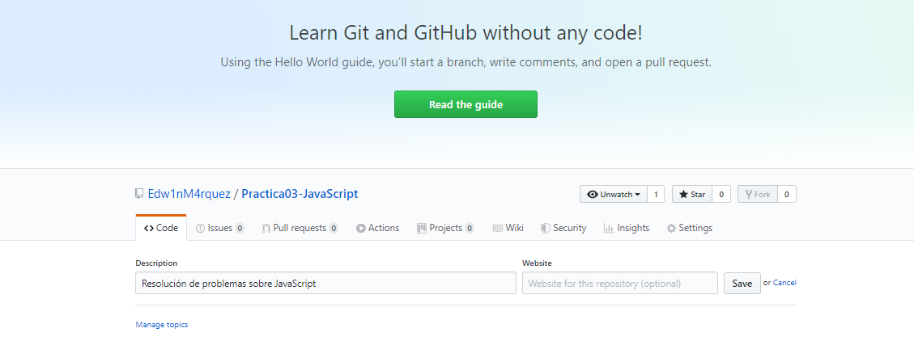
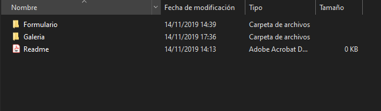
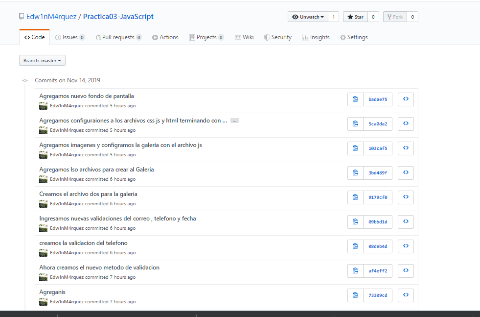
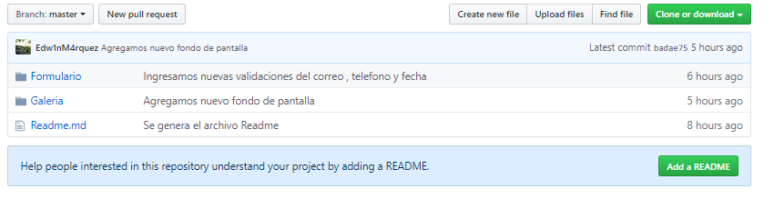

1.Crear un repositorio en GitHub con el nombre “Practica03 – Javascript”
 

2.	Crear una carpeta para la solución de cada ejercicio antes mencionado.
 
 
 
3.	Realizar un commit y push por cada requerimiento de los puntos antes descritos.
 

4.	Luego, se debe crear el archivo README del repositorio de GitHub.
 
 
 
5.	Generar los resultados de los requerimientos: 
1. Diseñar una interfaz en HTML que permita ingresar los siguientes campos en un formulario: cedula, nombres, apellidos, dirección, teléfono, fecha de nacimiento, correo electrónico y contraseña. Luego, usando funciones de JavaScript se pide validar que todos los campos han sido ingresados, además; que los valores ingresados en cada campo del formulario sean correctos teniendo en cuenta las siguientes condiciones:
 

-CODIGO
<!DOCTYPE html>
<html lang="es">

<head>
        <meta charset="UTF-8">
        <meta name="viewport" content="width=device-width, initial-scale=1.0">
        <meta http-equiv="X-UA-Compatible" content="ie=edge">
        
        <link rel="stylesheet" href="stylesF.css">
        <title>Document</title>
</head>

<body>
        

        <form id="formulario01" action=" " method="POST"
                onsubmit="return validarCamposObligatorios()">
                 
                 
                <label for="cedula">Cedula :</label>
                <input type="text" id="cedula" name="cedula" value="" maxlength="10"
                        placeholder="Ingrese el número de cedula ..."
                        onkeypress="ValidarNumeros(event,'mensajeCedula',this)" />
                 
                <span size=4 id="mensajeCedula">
                 
                 
                <label for="nombres">Nombres :</label>
                <input type="text" id="nombres" name="nombres" value="" 
placeholder="Ingrese sus dos nombres
..." onkeypress="ValidarLetras(event,'mensajeNombres',this)" />
                 
                <span id="mensajeNombres">
                 
                 
                <label for="apellidos">Apelidos :</label>
                <input type="text" id="apellidos" name="apellidos" value="" 
placeholder="Ingrese sus dos apellidos
..." onkeypress="ValidarLetras(event,'mensajeApellidos',this)" />
                 
                <span id="mensajeApellidos">
                 
                 
                <label for="direccion">Dirección :</label>
                <input type="text" id="direccion" name="direccion" value="" 
placeholder="Ingrese su dirección ..." />
                 
                <span id="mensajeDireccion">
                 
                 
                <label for="telefono">Teléfono :</label>
                <input type="text" id="telefono" name="telefono" value="" 
placeholder="Ingrese su número telefónico
..." onkeypress="ValidarTelefono(event,'mensajeTelefono',this)" />
                 
                <span id="mensajeTelefono">
                 
                 
                <label for="fecha">Fecha Nacimiento :</label>
                <input type="text" id="fechaNacimiento" name="fechaNacimiento" value="" 
placeholder="Ingrese su fecha de nacimiento ..." 
onkeypress="validarFecha(event, 'mensajeFecha',this)" />
                 
                <span id="mensajeFecha">
                 
                 
                <label for="correo">Correo electrónico :</label>
                <input type="text" id="correo" name="correo" value="" 
placeholder="Ingrese su correo electrónico
..." onkeypress="ValidarCorreo(event,'mensajeCorreo',this)" />
                 
                <span id="mensajeCorreo">
                 
                 
   <label for="contrasenia">Contraseña :</label>
                <input type="password" id="contrasenia" name="contrasenia" value=""
 placeholder="Ingrese su contrasenia
..." onkeypress="ValidarContra(event,'mensajeCorreo',this)" />
                 
                <span id="mensajeCorreo">
                 
                 

                <div class="form_boton"> 
                        <input type="submit" class="ingresar" id="crear"
 name="crear" value="Aceptar" />
                

        </form>
        
</body>

</html>

a. Se debe validar qué, en el campo de la cedula, se ingrese sólo números y que la misma sea correcta, 
en base, al último dígito verificador.
-WEB

 

 

-JAVASCRIPT
function ValidarNumeros(event, label, elemento) {
    let span = document.getElementById(label);
    let numero = event.which || event.keyCode;

    if (numero >= 48 && numero <= 57) {
        span.style.display = "none";
    } else {
        span.innerHTML = "Ingrese caracteres numericos"
        span.style.color = "orange"
        span.style.display = "block"
        let cantidad = elemento.value;
        cantidad = cantidad.substring(0, cantidad.length - 1)
        elemento.value = cantidad
    }

    if (elemento.value.length === 10) {
        validar(label, elemento);
    }
}

function validar(label, elemento) {
    cedula = elemento.value;
    let span = document.getElementById(label);
    var cad = cedula.trim();
    var total = 0;
    var longitud = cad.length;
    var longcheck = longitud - 1;

    if (cad !== "" && longitud === 10) {
        for (i = 0; i < longcheck; i++) {
            if (i % 2 === 0) {
                var aux = cad.charAt(i) * 2;
                if (aux > 9) aux -= 9;
                total += aux;
            } else {
                total += parseInt(cad.charAt(i));
            }
        }

        total = total % 10 ? 10 - total % 10 : 0;

        if (cad.charAt(longitud - 1) == total) {
            span.innerHTML = "Cedula Válida";
            span.style.display = "block"
            span.style.color = "green"
        } else {
            span.innerHTML = "Cedula Inválida";
            span.style.display = "block"
            span.style.color = "red"
        }
    }
}

2)	Se debe validar qué, en el campo del nombre, ingrese mínimo un nombre y que permita ingresar sólo letras.
-WEB
 

 
-JAVASCRIPT

function ValidarLetras(event, label, elemento) {
    let span = document.getElementById(label);
    let letra = event.which || event.keyCode;

    if (letra >= 65 && letra <= 90 || letra >= 97 && letra <= 122 || letra == 32 ||
     letra == 8 || letra == 16) {
        span.style.display = "none";
    } else {
        span.innerHTML = "Ingrese letras"
        span.style.display = "block"
        span.style.color = "orange"
        let frase = elemento.value;
        frase = frase.substring(0, frase.length - 1)
        elemento.value = frase
    }

    let wordCount = elemento.value.trim().replace(/\s+/gi, ' ').split(' ').length;

    if (wordCount > 1) {
        span.innerHTML = "Ingrese solo un nombre"
        span.style.display = "block"
        span.style.color = "orange"
        let frase = elemento.value;
        frase = frase.substring(0, frase.length - 2)
        elemento.value = frase
    }
}

3)	Se debe validar qué, en el campo del apellido, ingrese mínimo un
apellido y que permita ingresar sólo letras.
-WEB
 

 

-JAVASCRIPT
function ValidarLetras(event, label, elemento) {
    let span = document.getElementById(label);
    let letra = event.which || event.keyCode;

    if (letra >= 65 && letra <= 90 || letra >= 97 && letra <= 122 || letra == 32 ||
     letra == 8 || letra == 16) {
        span.style.display = "none";
    } else {
        span.innerHTML = "Ingrese letras"
        span.style.display = "block"
        span.style.color = "orange"
        let frase = elemento.value;
        frase = frase.substring(0, frase.length - 1)
        elemento.value = frase
    }

    let wordCount = elemento.value.trim().replace(/\s+/gi, ' ').split(' ').length;

    if (wordCount > 1) {
        span.innerHTML = "Ingrese solo un apellido"
        span.style.display = "block"
        span.style.color = "orange"
        let frase = elemento.value;
        frase = frase.substring(0, frase.length - 2)
        elemento.value = frase
    }
}

4)	Se debe validar qué, en el campo del teléfono, permita ingresar sólo
números y un máximo de 10.-WEB

 

-JAVASCRIPT

function ValidarTelefono(event, label, elemento) {
    let span = document.getElementById(label);
    let numero = event.which || event.keyCode;

    if (numero >= 48 && numero <= 57) {
        span.style.display = "none";
    } else {
        span.innerHTML = "Ingrese caracteres numericos"
        span.style.display = "block"
        span.style.color = "red"
        let cantidad = elemento.value;
        cantidad = cantidad.substring(0, cantidad.length - 1)
        elemento.value = cantidad
    }

    if (elemento.value.length >= 10) {
        validar(label, elemento);
        span.innerHTML = "Solo ingrese diez numeros"
        span.style.display = "block"
        span.style.color = "red"
        let cantidad = elemento.value;
        cantidad = cantidad.substring(0, cantidad.length - 1)
        elemento.value = cantidad
    }
}

5)	Se debe validar que la fecha de nacimiento ingrese en el formato
dd/mm/yyyy.
-WEB
 

 

-JAVASCRIPT

function validarFecha(event, label, element) {
    let span = document.getElementById(label);
    let caracter = event.which || event.keyCode;
    let elemento = element.value

    if (validarFormatoFecha(element)) {
        if (fechaExistente(elemento)) {
            span.innerHTML = "Fecha Valida"
            span.style.display = "block"
            span.style.color = "green"
        } else {
            span.innerHTML = "Fecha Invalida"
            span.style.display = "block"
            span.style.color = "red"
        }
    } else {
        span.innerHTML = "Formato Invalido"
        span.style.display = "block"
        span.style.color = "red";
    }

    if (elemento.length >= 11) {
        span.innerHTML = "Fecha fuera de rango"
        span.style.display = "block"
        span.style.color = "red"
        let cantidad = element.value;
        cantidad = cantidad.substring(0, cantidad.length - 1)
        element.value = cantidad
    }

}

function validarFormatoFecha(element) {
    let elemento = element.value
    var formato = /^\d{1,2}\/\d{1,2}\/\d{2,4}$/;
    if ((elemento.match(formato)) && (elemento != '')) {
        return true;
    } else {
        return false;
    }
}

function fechaExistente(fecha) {
    var fechaf = fecha.split("/");
    var day = fechaf[0];
    var month = fechaf[1];
    var year = fechaf[2];
    var date = new Date(year, month, '0');
    if ((day - 0) > (date.getDate() - 0)) {
        return false;
    }
    return true;
}

6)	Se debe validar qué, en el campo correo electrónico, permita ingresar un
correo válido. Se considera un correo válido, cuando comienza por tres o
más valores alfanuméricos, luego un @, seguido por la extensión
“ups.edu.ec” o “est.ups.edu.ec”.
-WEB
 

-JAVASCRIPT

function ValidarCorreo(event, label, elemento) {
    let span = document.getElementById(label);
    let caracter = event.which || event.keyCode;
    let correo = elemento.value;
    let email = /^\w+([\.-]?\w+)*@\w+([\.-]?\w+)*(\.\w{2,4})+$/;
    span.innerHTML = ""
    span.style.display = "block"

    if (!email.test(correo)) {
        span.innerHTML = "Correo Invalido"
        span.style.display = "block"
        span.style.color = "red"

    } else if (!email.test(correo)) {
        span.innerHTML = "Correo Invalido"
        span.style.display = "block"
        span.style.color = "red"

    } else {
        span.innerHTML = "Correo Valido"
        span.style.display = "block"
        span.style.color = "green"

    }

}

7)	Se debe validar que la contraseña ingresada tenga mínimo 8 caracteres, además, debe incluir al menos: una letra mayúscula, una letra minúscula y un carácter especial (@, _, $)}
-WEB
 

 

-JAVASCRIPT
function ValidarContra(event, label, element){
 
    let span = document.getElementById(label);
    contrase=element.value;
    console.log(contrase.length);

    if(contrase.length >= 8)
            {       
                span.innerHTML = " "
              
                var mayuscula = false;
                var minuscula = false;
                var numero = false;
                var caracter_raro = false;
                
                for(var i = 0;i<contrase.length;i++)
                {
                    if(contrase.charCodeAt(i) >= 65 && contrase.charCodeAt(i) <= 90)
                    {
                        mayuscula = true;
                    }
                    else if(contrase.charCodeAt(i) >= 97 && contrase.charCodeAt(i) <= 122)
                    {
                        minuscula = true;
                    }
                    else if(contrase.charCodeAt(i) >= 48 && contrase.charCodeAt(i) <= 57)
                    {
                        numero = true;
                    }
                    else
                    {
                        caracter_raro = true;
                    }
                }
                
                if(mayuscula == true && minuscula == true && caracter_raro == true && numero == true)
                {
                    return true;
                }else{
                    span.innerHTML = "Ingrese caracteres especiales (@, _, $) "
                    span.style.color = "orange"
                    span.style.display = "block"
                }

            }else if(contrase < 8){
                
                    span.innerHTML = "Ingrese mas de 8 caracteres"
                    span.style.color = "orange"
                    span.style.display = "block"
                
                    
            }
            return false;
}
                            
8)	Las demás validaciones se realizarán al momento de “enviar” (submit) la información del formulario hacia una página php. Si no cumple las validaciones, se mostrará un mensaje debajo de cada campo con el error y se pintará el campo con un borde rojo que representará que el campo tiene un error. Si se cumple las validaciones, se enviará a una página php, en donde se mostrará únicamente un mensaje que diga “Bienvenido, ¡pasaste las validaciones!”. 
 

 

6.	Diseñar una interfaz en html que tenga tres botones que diga “Anterior”, “Iniciar”, “Siguiente”, y una imagen. Luego, desde javascript se debe controlar para al hacer clic sobre uno de los botones realice una acción relacionada a una galería de imágenes.
 

-JAVASCRIPT
imagen1 = ''
imagen2 = ''
imagen3 = ''
imagen4 = ''
imagen5 = ''
imagen6 = ''
imagen7 = ''
imagen8 = ''
imagen9 = ''
imagen10 = ''

var fotos = [imagen1, imagen2, imagen3, imagen4, imagen5, imagen6, imagen7, imagen8, imagen9, imagen10];

var aleatorios = new Array(5);
var numeroImagen = 0;

function iniciar() {
    numeroImagen = 0;
    aleatoriosR(fotos)

    console.log(aleatorios)

    document.getElementById('anterior').disabled = true;

    document.getElementById('imagen').innerHTML = aleatorios[numeroImagen];
}

function siguiente() {
    numeroImagen = numeroImagen + 1;

    console.log(numeroImagen)

    if (numeroImagen == 4) {
        document.getElementById('siguiente').disabled = true;

    } else {

        if(numeroImagen>0){
            document.getElementById('anterior').disabled = false;
        }

        document.getElementById('siguiente').disabled = false;

    }

    document.getElementById('imagen').innerHTML = aleatorios[numeroImagen];

}

function anterior() {

    if (numeroImagen === 0) {
        document.getElementById('anterior').disabled = true;

    } else {

        if(numeroImagen<4){
            document.getElementById('siguiente').disabled = false;

        }
        document.getElementById('anterior').disabled = false;

    }
    console.log(numeroImagen)
    document.getElementById('imagen').innerHTML = aleatorios[numeroImagen];
    numeroImagen = numeroImagen - 1;

}

function aleatoriosR(elementos) {

    var numaletorios=numerosAleatorios(elementos)
    console.log(numaletorios[0])
    console.log(numaletorios[1])
    console.log(numaletorios[2])
    console.log(numaletorios[3])
    console.log(numaletorios[4])

    for (var i = 0; i < 5; i++){
        aleatorios[i]=fotos[numaletorios[i]]
    }
}

function numerosAleatorios() {
    var cantidadNumeros = 5;
    var myArray = []
    while(myArray.length < cantidadNumeros ){
      var numeroAleatorio = Math.ceil(Math.random()*9);
      var existe = false;
      for(var i=0;i<myArray.length;i++){
        if(myArray [i] == numeroAleatorio){
            existe = true;
            break;
        }
      }
      if(!existe){
        myArray[myArray.length] = numeroAleatorio;
      }
    
    }

    return myArray;
}

7.	Se debe tener, un arreglo con los nombres de diez imágenes, previamente descargadas y almacenadas en una carpeta llamada “images”.
 
 

-JAVASCRIPT
imagen1 = ''
imagen2 = ''
imagen3 = ''
imagen4 = ''
imagen5 = ''
imagen6 = ''
imagen7 = ''
imagen8 = ''
imagen9 = ''
imagen10 = ''

var fotos = [imagen1, imagen2, imagen3, imagen4, imagen5, imagen6, imagen7, imagen8, 
imagen9, imagen10];

8.	La galería de imágenes debe visualizar exclusivamente 5 imágenes.
var fotos = [imagen1, imagen2, imagen3, imagen4, imagen5, imagen6, imagen7, 
imagen8, imagen9, imagen10];

var aleatorios = new Array(5);
var numeroImagen = 0;

9.	Cada vez que se haga clic en le botón iniciar se deben escoger de manera aleatoria cinco imágenes de las diez que se mostrarán en la galería de imágenes.
 

-JAVASCRIPT

function iniciar() {
    numeroImagen = 0;
    aleatoriosR(fotos)

    console.log(aleatorios)

    document.getElementById('anterior').disabled = true;

    document.getElementById('imagen').innerHTML = aleatorios[numeroImagen];
}

function aleatoriosR(elementos) {

    var numaletorios=numerosAleatorios(elementos)
    console.log(numaletorios[0])
    console.log(numaletorios[1])
    console.log(numaletorios[2])
    console.log(numaletorios[3])
    console.log(numaletorios[4])

    for (var i = 0; i < 5; i++){
        aleatorios[i]=fotos[numaletorios[i]]
    }
}

function numerosAleatorios() {
    var cantidadNumeros = 5;
    var myArray = []
    while(myArray.length < cantidadNumeros ){
      var numeroAleatorio = Math.ceil(Math.random()*9);
      var existe = false;
      for(var i=0;i<myArray.length;i++){
        if(myArray [i] == numeroAleatorio){
            existe = true;
            break;
        }
      }
      if(!existe){
        myArray[myArray.length] = numeroAleatorio;
      }
    
    }

    return myArray;
}

10.	Al hacer clic en el botón siguiente y haber llegado a la última imagen disponible, el botón siguiente deberá ser deshabilitado (sólo cuando se ha llegado a la última imagen el botón siguiente deberá estar deshabilitado)
-JAVASCRPIT

function siguiente() {
    numeroImagen = numeroImagen + 1;

    console.log(numeroImagen)

    if (numeroImagen == 4) {
        document.getElementById('siguiente').disabled = true;

    } else {

        if(numeroImagen>0){
            document.getElementById('anterior').disabled = false;
        }

        document.getElementById('siguiente').disabled = false;

    }

    document.getElementById('imagen').innerHTML = aleatorios[numeroImagen];

}

-WEB
 
11.	Al hacer clic en el botón anterior y haber llegado a la primera imagen disponible,el botón anterior deberá ser deshabilitado (sólo cuando se ha llegado a la últimaimagen y cuando se inicie la galería de imágenes el botón anterior deberá estar deshabilitado)
-WEB
 
-JAVASCRPIT

function anterior() {

    if (numeroImagen === 0) {
        document.getElementById('anterior').disabled = true;

    } else {

        if(numeroImagen<4){
            document.getElementById('siguiente').disabled = false;

        }
        document.getElementById('anterior').disabled = false;

    }
    console.log(numeroImagen)
    document.getElementById('imagen').innerHTML = aleatorios[numeroImagen];
    numeroImagen = numeroImagen - 1;

}
